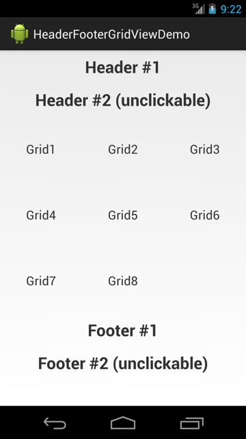

# HeaderFooterGridView

HeaderFooterGridView supports adding header rows and footer rows to GridView for Android.  
GridView supports header rows is [made by Google](http://grepcode.com/file/repository.grepcode.com/java/ext/com.google.android/android-apps/4.4_r1/com/android/photos/views/HeaderGridView.java), we added footer rows to it.



## License

```
Copyright (C) 2013 The Android Open Source Project

Licensed under the Apache License, Version 2.0 (the "License");
you may not use this file except in compliance with the License.
You may obtain a copy of the License at

    http://www.apache.org/licenses/LICENSE-2.0

Unless required by applicable law or agreed to in writing, software
distributed under the License is distributed on an "AS IS" BASIS,
WITHOUT WARRANTIES OR CONDITIONS OF ANY KIND, either express or implied.
See the License for the specific language governing permissions and
limitations under the License.

---

Copyright (C) 2014  Recruit Marketing Partners Co.,Ltd

Licensed under the Apache License, Version 2.0 (the "License");
you may not use this file except in compliance with the License.
You may obtain a copy of the License at

    http://www.apache.org/licenses/LICENSE-2.0

Unless required by applicable law or agreed to in writing, software
distributed under the License is distributed on an "AS IS" BASIS,
WITHOUT WARRANTIES OR CONDITIONS OF ANY KIND, either express or implied.
See the License for the specific language governing permissions and
limitations under the License.
```
